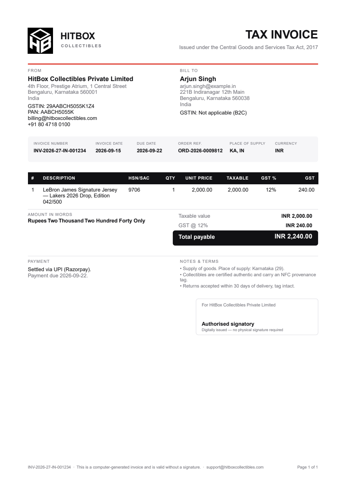
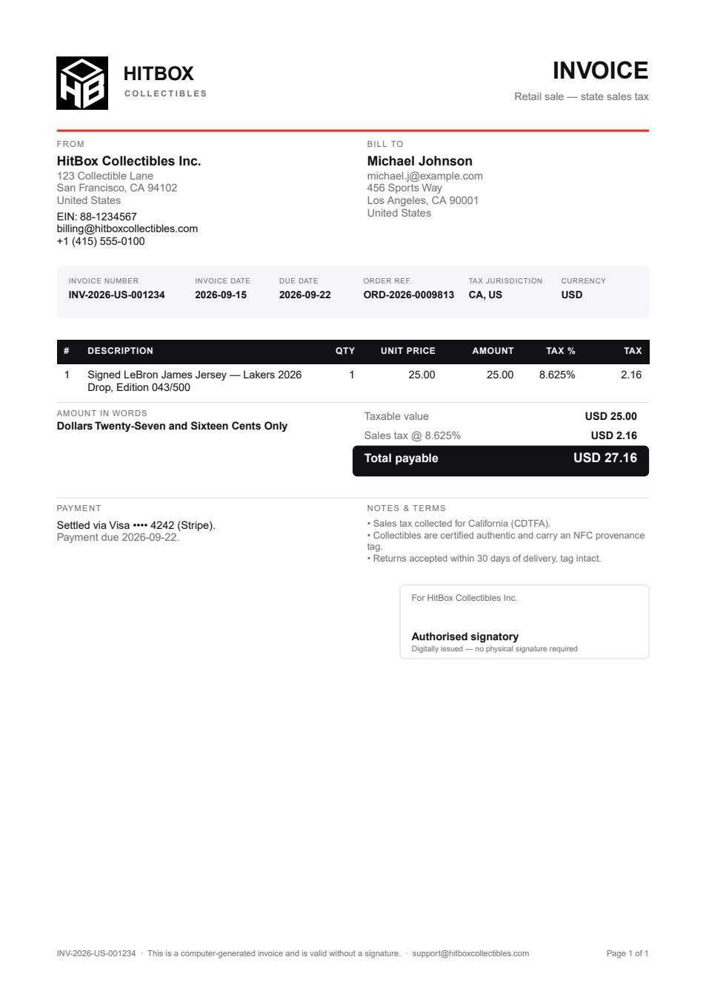

# The reference invoices

Two invoices, driven with the exact figures the compliance guide prints, and
produced by the same renderer the service uses.

```bash
pnpm --filter @hitbox/tax demo:invoice            # render to docs/tax/examples/
pnpm --filter @hitbox/tax demo:invoice -- --upload # …and put them in S3
```

They exist because the PDF is the one artefact in this system whose correctness
is a visual judgement — you cannot assert your way to "this looks like a tax
invoice". So the output is the reference a reviewer and a test can both compare
against. The script touches no database.

| | India (GST) | United States (sales tax) |
| --- | --- | --- |
| File | [`INV-2026-27-IN-001234.pdf`](examples/INV-2026-27-IN-001234.pdf) | [`INV-2026-US-001234.pdf`](examples/INV-2026-US-001234.pdf) |
| Guide reference | §1.1, §1.4 | §2.1, §2.3 |
| Sale price | ₹2,000.00 | $25.00 |
| Rate | GST **12%** | Sales tax **8.625%** |
| Tax | ₹240.00 | $2.16 |
| Total | ₹2,240.00 | $27.16 |
| S3 key | `tax-invoices/IN/2026-27/INV-2026-27-IN-001234.pdf` | `tax-invoices/US/2026/INV-2026-US-001234.pdf` |
| SHA-256 | `e95bd762…602d9` | `a9d3084f…44110b` |

---

## India — `TAX INVOICE`



What to look at, top to bottom:

**Header.** The heading is literally `TAX INVOICE` — that is the statutory
heading under Indian GST rules, and an invoice headed anything else is a
commercial document rather than a tax one. The subtitle names the Act.

**FROM.** HitBox's GSTIN and PAN. The GSTIN is the field that makes this a tax
invoice; the renderer refuses to draw an Indian invoice without one, before a
single byte is written.

**BILL TO.** `GSTIN: Not applicable (B2C)` is **printed**, not omitted. A blank
line reads like a field someone forgot to fill in; the explicit answer is the
B2C case stated.

**Meta strip.** `Place of supply: KA, IN` — the field the GST department matches
against. Columns are weighted, not equal, so a long invoice number does not wrap
while the currency code sits in white space.

**Line table.** `HSN/SAC 9706`, mandatory per §1.3 and validated twice (the DTO
rejects an Indian rate without a code; the renderer refuses a line without one).
Columns: unit price, taxable value, GST %, GST amount.

**Amount in words.** `Rupees Two Thousand Two Hundred Forty Only`, in the Indian
numbering system — thousand, lakh, crore. Conventional on an Indian invoice and
a real control: a transposed digit in `24,20.00` is invisible; the words are
not.

**Digit grouping.** `INR 2,000.00` here, but `12,34,567.00` on a larger figure —
the lakh/crore convention. An Indian invoice that groups in thousands looks
foreign to whoever reads it.

**Totals.** The tax line is named for its regime: `GST @ 12%`.

**Signature box.** "Authorised signatory — digitally issued, no physical
signature required", covering §1.4's signature/stamp requirement.

**Footer.** Invoice number, "computer-generated… valid without a signature",
support address, and `Page 1 of 1` on every page.

---

## United States — `INVOICE`



The differences from the Indian document, all of them deliberate:

**Heading is `INVOICE`.** There is no federal invoice law in the US, so there is
no statutory heading to use.

**No HSN/SAC column at all.** It is meaningless here, and an empty column reads
as missing data. The renderer builds a different column set per jurisdiction
rather than blanking cells.

**EIN instead of GSTIN/PAN**, and its absence does not block issue — §2.3 makes
these best practice rather than law.

**`Tax jurisdiction: CA, US`** instead of "place of supply".

**`8.625%` prints in full.** This is the case that justified widening every rate
column from `Decimal(5,2)` to `Decimal(6,3)`: at two decimals it would read
`8.63%`, a rate that appears in no CDTFA rate table and cannot be reconciled
against one. The **amount** is still `$2.16` — the exact product is 2.15625 and
the half-up rounding happens once, at the end, at the 2-decimal invoice scale.

**Grouping in threes**, and words in the short scale: `Dollars Twenty-Seven and
Sixteen Cents Only`.

---

## Why the currency code and not the symbol

Amounts print `INR 2,000.00`, not `₹2,000.00`.

PDFKit's built-in fonts are WinAnsi-encoded and have no ₹ (U+20B9) — printing
one produces a wrong glyph or a blank on a statutory document. Embedding a
Unicode font to gain a single character would mean shipping a font file the
render depends on and that can go missing. `INR 2,000.00` is unambiguous, is
what a bank statement and a GST return both use, and cannot render incorrectly.

---

## The logo

The lockup in the top-left is the brand mark — an isometric cube reading
**HB**, white on solid black — set beside a "HITBOX / COLLECTIBLES" wordmark.

The wordmark is *type, not part of the image*, because the supplied mark is
square rather than a horizontal lockup. An invoice should name its supplier
prominently: the legal name in the FROM block is the statutory field, but the
reader identifies the document by what is at the top of it.

Three files, two of them generated:

```text
assets/hitbox-logo.svg                  ← source of truth (vector, 706×722)
assets/hitbox-logo.png                  ← GENERATED raster, 384px
src/infrastructure/hitbox-logo.asset.ts ← GENERATED, base64, what ships
```

```bash
pnpm --filter @hitbox/tax logo:generate
```

**The raster step is not optional.** PDFKit's `doc.image()` accepts PNG and
JPEG only — handing it an SVG buffer throws. So the vector is rasterised once,
at build time, which also keeps an image-conversion dependency out of the render
path and makes the exact pixels that go on an invoice reviewable in a diff.

384px is sized for **print, not screen**: the mark prints ~40pt tall, which is
0.56 inch, and 600 dpi of that is ~333px. sharp rasterises at `density: 600` so
the cube's diagonals stay clean rather than being upscaled from a 72dpi render.

The base64 is emitted as 96-character single-quoted chunks rather than one
enormous line, so re-generating the mark produces a readable diff instead of one
unreviewable 20 KB line.

To change the logo: replace the SVG, re-run `logo:generate`, re-run
`demo:invoice`. Or point `TAX_INVOICE_LOGO_PATH` at a PNG on disk to override it
per deployment — a path that does not exist falls back to the embedded mark
rather than failing the render, because a wrong logo is cosmetic and an invoice
that could not be issued is a compliance problem.

---

## Two properties these files demonstrate

**One page.** A one-line invoice is one page. That is a real regression guard,
not a triviality — writing the footer below the bottom margin made PDFKit add a
page per footer, silently turning every invoice into three pages, and
`countPages()` in the renderer test now pins it.

**Byte-for-byte reproducible.** Re-running the script produces the same two
SHA-256 digests. The renderer is a pure projection of the invoice row: no clock,
no database, no configuration read at draw time. That is what makes
`Invoice.pdfSha256` meaningful as integrity evidence years later — the document
can be re-derived and compared rather than merely trusted.

---

## Varying them

Both models are plain objects in
`packages/tax/scripts/render-demo-invoice.ts`. Useful things to try:

- `status: 'VOID'` with a `voidReason` — adds the diagonal stamp
- a second entry in the `calculateInvoice([...])` array at a different
  `taxRate` — shows per-line tax and a null header rate
- drop `gstin` from the Indian supplier — the render refuses, with the missing
  fields named
